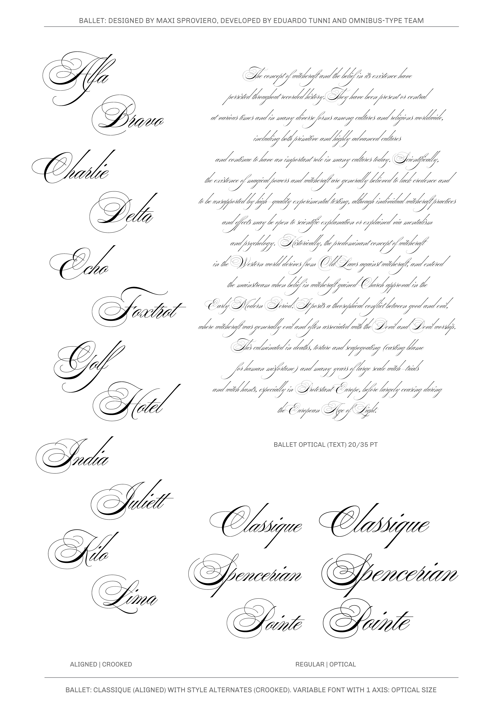

# Ballet family

**Omnibus-Type**  
*SIL Open Font License, 1.1*

Ballet is a reinterpretation of the classic Spencerian script style with a few whimsical twists in two different versions: Ballet aligned and crooked, both with Latin GF Plus character set (+630 characters/+800 glyphs). Typeface design by Maximiliano Sproviero, typeface development by Eduardo Tunni. 

#### Ballet contains:

* Ballet-Display
* Ballet-Text

To contribute to the project contact [Omnibus Type](http://omnibus-type.com/).

### Designers

* Maximiliano Sproviero

### License

Copyright (c) 2020, Omnibus-Type (www.omnibus-type.com | omnibus.type@gmail.com)

Licensed under the [*SIL Open Font License, 1.1*](http://scripts.sil.org/OFL); you may not use this file except in compliance with the License.

======
## FONTLOG for the Ballet fonts

This file provides detailed information on the Ballet font software.  
This information should be distributed along with the Ballet fonts and any derivative works.

### Ballet is a typeface family that supports Unicode language range: 

* Basic Latin 					U+0020-U+007E
* Latin-1 Supplement 			U+00A0-U+00FF
* Latin Extended-A 				U+0100-U+017F
* Latin Extended Additional*	U+1E00-U+1EFF *(111/256)

**Character map to support MS Codepages:**
* 1252 Latin-1
* 1250 Latin-2 (Easter Europe)
* 1254 Turkish
* 1257 Windows Baltic
* 1258 Vietnamese
* Mac Roman

*To contribute to the project contact Omnibus-Type at omnibus.type@gmail.com*

**04 Jan 2020 (v.1.000) Omnibus-Type**  
- Initial release

### Acknowledgements

If you make modifications be sure to add your name (N), email (E), web-address
(if you have one) (W) and description (D). This list is in alphabetical order.

**N:** **Maximiliano Sproviero**  
**E:** omnibus.type@gmail.com  
**W:** http://www.omnibus-type.com  
**D:** Designer

**N:** **Eduardo Tunni**  
**E:** omnibus.type@gmail.com  
**W:** http://www.omnibus-type.com  
**D:** Typeface development